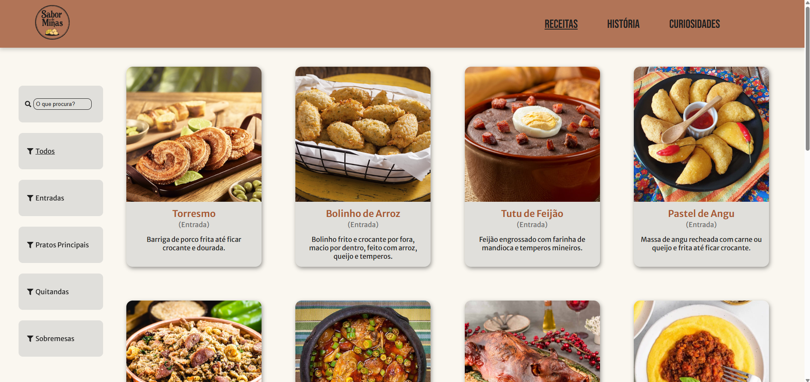
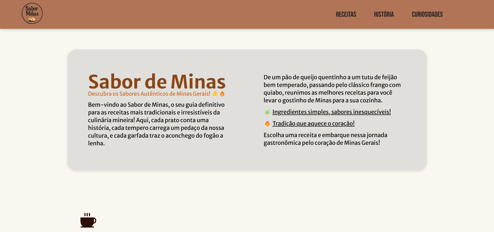

# Sabor de Minas

This project was developed by **Luis Cláudio** using **React with Vite** for the frontend. The goal was to enhance my React skills by creating an interactive and modern web application that showcases the cuisine of Minas Gerais.

## 📝 Project Overview

**Sabor de Minas** is a Single Page Application (SPA) that presents the rich culinary traditions of Minas Gerais. The website features curiosities, stories, and traditional recipes, providing an immersive experience for food enthusiasts.

## 🛠️ Technologies Used

- **React.js**
- **Vite** (for fast development environment)
- **React Router DOM** (for page navigation)
- **Axios** (for API consumption)
- **React Icons** (for a more attractive design)
- **CSS3** (modern and responsive design)

---

## 🚀 How to Run the Project

### 1️⃣ Clone the repository

```sh
git clone <repository_url>
cd sabor-de-minas
```

### 2️⃣ Install dependencies

```sh
npm install
```

### 3️⃣ Run the project

```sh
npm run dev
```

### 4️⃣ Open in your browser

Open your browser and access the URL provided by Vite (usually http://localhost:5173/).

---

## 📌 Features

✅ Presents information about Minas Gerais cuisine  
✅ Displays curiosities about traditional dishes  
✅ Shows detailed traditional recipes  
✅ Modern and responsive interface  
✅ Smooth navigation using React Router  
✅ Uses React Icons for better visual experience  

---

## 📚 Project Structure

```
/sabor-de-minas
│── /node_modules
│── /public
│── /src
│   │── /components
│   │   │── /Home
│   │   │── /Pages
│   │   │── /RecipePage
│   │   │── /Recipes
│   │   │── /Utils
│   │── App.css
│   │── App.jsx
│   │── index.css
│   │── index.html
│   │── main.jsx
│── .gitignore
│── eslint.config.js
│── package-lock.json
│── package.json
│── README.md
│── vite.config.js       
```

---

## 🔥 About the Project

This project was developed to deepen my knowledge in **React and frontend development**, focusing on building a modern and responsive Single Page Application (SPA).

---

## 🌟 Screenshots




---

🚀 **Developed by Luis Cláudio** 💪